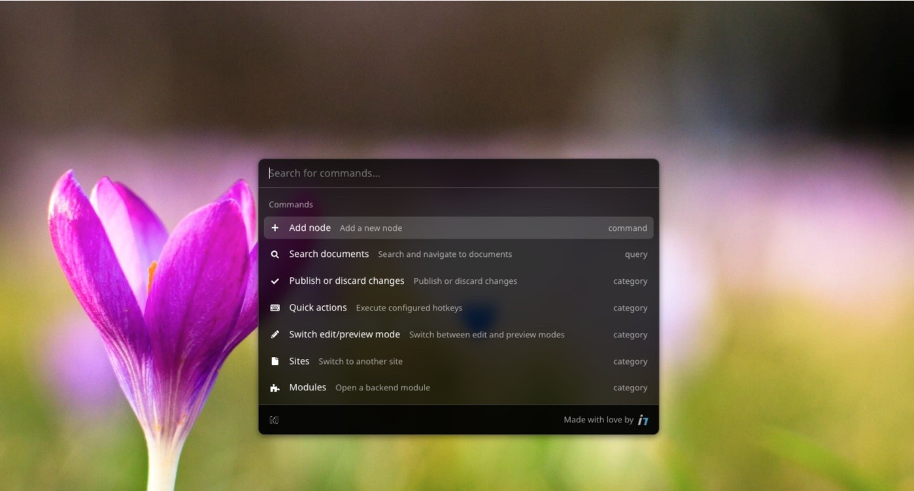

# Command bar (CMD+K) plugin for Neos CMS

[](https://github.com/Sebobo/Shel.Neos.CommandBar/actions/workflows/tests.yml)

This package provides a command bar plugin for Neos CMS similar to
Spotlight, [Raycast](https://www.raycast.com) or [Alfred](https://www.alfredapp.com/). 
It allows you to quickly search and execute commands and navigate in [NeosCMS](https://neos.io).

## Features

* 🔍 Open commandbar via CMD+K or CTRL+K in the Neos content module
* ⚡️ Quickly search for commands (fuzzy search enabled to handle spelling mistakes)
* 🔥 Offer most registered hotkeys as selectable commands 
  * some are excluded via configuration as they won't work in the context of the command bar
  * automatically includes hotkeys from other packages
* 🧭 Navigation commands
  * Jump to module
  * Jump to site
  * Search and open document node
  * Search and navigate to the Neos documentation (enabled in Development context)
  * Search and navigate to the Neos plugin repository (enabled in Development context)
* ➕ Open node creation dialog relative to the current node
* 📝 Switch edit/preview mode
* 📰 Publish / discard changes on current page or all changes
* ⭐️ Mark commands as favourites (stored in Neos user preferences)
* 🗄️ Store recent commands (stored in Neos user preferences)
* 🧩 Backend module integration
  * Open the command bar from within the backend modules which have the module enabled (global inclusion possible with Neos 8.3)
* 🪛 Extensibility
  * Add new commands via the provided ´Shel.Neos.CommandBar` registry in your plugin manifests

## Screenshot



## Installation

Run the following command in your Neos site package

```console
composer require --no-update shel/neos-commandbar
```

The run `composer update` in your project root folder.

## Enabling the command bar in additional backend modules

By default, only the core Neos modules have the command bar enabled as a global inclusion will only be possible with Neos 8.3. 
If you want to enable the command bar in a backend module, you can do so by adding the following setting:

```yaml
Neos:
  Neos:
    modules:
      <MODULE_PATH>:
        submodules:
          <MODULE_NAME>:
            additionalResources: 
              javaScripts:
                Shel.Neos.CommandBar: 'resource://Shel.Neos.CommandBar/Public/Module.js'
              styleSheets:
                Shel.Neos.CommandBar: 'resource://Shel.Neos.CommandBar/Public/Module.css'
```

## Disable branding

If you supported the development of this package, or you don't want to show the branding, you can disable it via the following setting:

```yaml
Shel:
  Neos:
    CommandBar:
      features:
        showBranding: false
```

## Add additional commands

Additional commands can be added to the UI plugin via the Neos UI extensibility API.

Here is an example `manifest.js` which adds a simple command to the command bar:

```javascript
import manifest, { SynchronousRegistry } from '@neos-project/neos-ui-extensibility';
import { selectors } from '@neos-project/neos-ui-redux-store';

manifest('My.Vendor:CommandBarPlugin', {}, (globalRegistry, { store, frontendConfiguration }) => {
    globalRegistry.get('Shel.Neos.CommandBar').set('plugins/My.Vendor:Example.Alert', async () => {
        return {
            extensibilityTest: {
                name: 'Example alert command',
                icon: 'vial',
                description: 'Command registered via command bar extensibility',
                canHandleQueries: true,
                action: async (query) => {
                    const state = store.getState();
                    const documentNode = selectors.CR.Nodes.documentNodeSelector(state);
                    window.alert(`The current document node is ${documentNode.label} and the query is ${query}.`);
                },
            },
        };
    });
});
```

## Development

⚠️ This package offers 2 plugins. One is the Neos.UI plugin built with Neos extensibility React based API and the other 
is the backend module plugin built with ParcelJS and Preact.
We use yarn workspaces to manage the code for the 2 plugins, the dev server and the shared components.
Most of the code is shared and only a small wrapper is needed to make the components work in the UI and module environments.

Each plugin has its own setup and build process. The following sections describe how to set up and build each plugin.

### Setup

First install all dependencies:

```console
yarn
```

For developing the command bar component itself, you can run the following command to start a dev server:

```console
yarn dev
```

To develop the Neos plugin, you can run the following command to watch for changes and rebuild the plugin:

```console
yarn watch
```

Or watch them individually

```console
yarn watch-ui
yarn watch-module
```

To build both plugins for production, run the following command:

```console
yarn build
```

Or run the build for each plugin individually

```console
yarn build-ui
yarn build-module
```

## License

This package is licensed under the MIT license. See [license](LICENSE.txt) for details.
