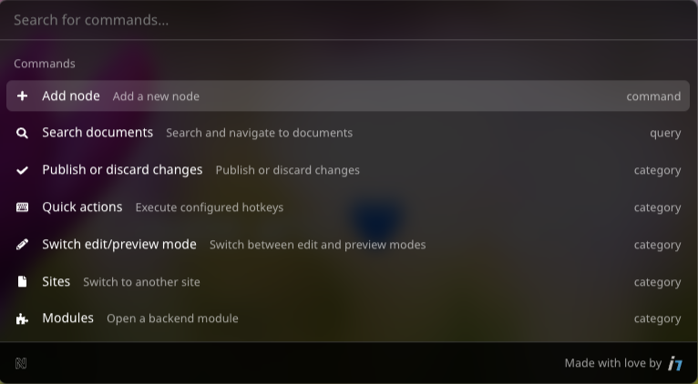

# Command bar (CMD+K) plugin for Neos CMS

[](https://github.com/Sebobo/Shel.Neos.CommandBar/actions/workflows/tests.yml)

This package provides a command bar plugin for Neos CMS.

⚠️ This package is a work in progress and not ready for production use yet.

## Features

* 🔍 Open commandbar via CMD+K or CTRL+K in the Neos content module
* ⚡️ Quickly search for commands (fuzzy search enabled to handle spelling mistakes)
* 🔥 Offer most registered hotkeys as selectable commands 
  * some are excluded via configuration as they won't work in the context of the command bar
  * automatically includes hotkeys from other packages
* 🧭 Navigation commands
  * Jump to module
  * Jump to site
  * Search and open document node
* ➕ Open node creation dialog relative to the current node
* 📝 Switch edit/preview mode
* 📰 Publishing
  * Publish / discard changes on current page
  * Publish / discard all changes
* 🪛 Extensibility
  * Add new commands via the provided ´Shel.Neos.CommandBar` registry in your plugin manifests
* 🧩 Backend module integration
  * Open the command bar from within the backend modules which have the module enabled (global inclusion possible with Neos 8.3)

## Screenshot



## Installation

As the plugin is still in development, you need to add the package to your `composer.json` manually:

```json
{
  "repositories": [
    {
      "type": "vcs",
      "url": "https://github.com/Sebobo/Shel.Neos.CommandBar"
    }
  ]
}
```

Then you can install the package via composer:

```console
composer require shel/neos-commandbar:@dev
```

## Development

First install all dependencies:

```console
yarn
```

For developing the command bar component itself, you can run the following command to start a dev server:

```console
yarn dev
```

To develop the Neos plugin, you can run the following command to watch for changes and rebuild the plugin:

```console
yarn start
```

To build the plugin for production, run the following command:

```console
yarn build
```

## License

This package is licensed under the MIT license. See [license](LICENSE.txt) for details.
